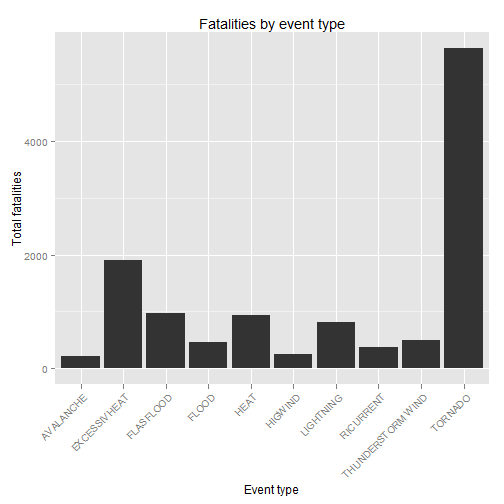
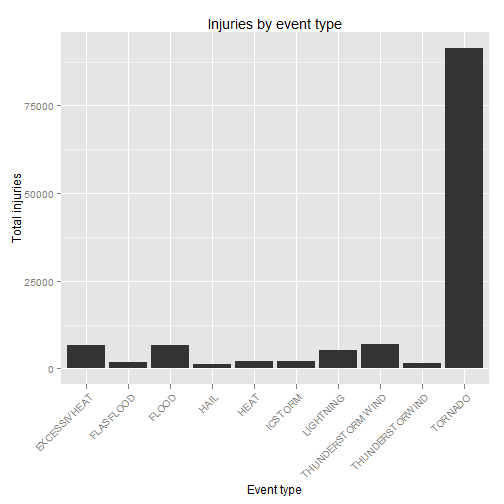
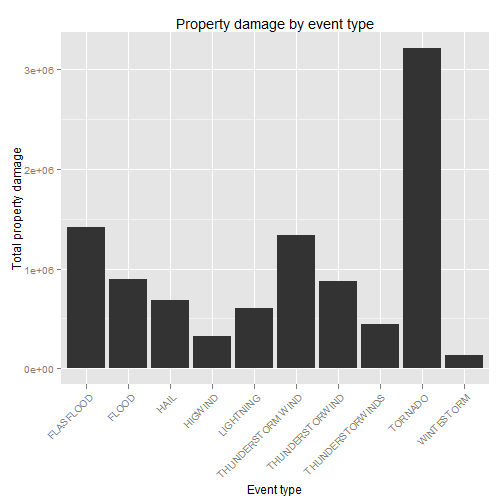

Storm report
========================================================
# Synopsis

Storms and other severe weather events can cause both public health and economic problems for communities and municipalities. Many severe events can result in fatalities, injuries, and property damage, and preventing such outcomes to the extent possible is a key concern.

This project involves exploring the U.S. National Oceanic and Atmospheric Administration's (NOAA) storm database. This database tracks characteristics of major storms and weather events in the United States, including when and where they occur, as well as estimates of any fatalities, injuries, and property damage.

# Data Processing

It's required to load the data and select the columns to be analyzed.


```r
data<-read.csv(file = bzfile("stormData.csv.bz2"), strip.white = TRUE)
data2 <- data[,c("EVTYPE", "FATALITIES", "INJURIES", "PROPDMG")]
```

Then, we have to make all of the categories to be similar in capital letters in a standard way.


```r
data2$EVTYPE<-toupper(data2$EVTYPE)
data2$EVTYPE<-gsub(". ", "", data2$EVTYPE)

data2$EVTYPE<-ifelse(data2$EVTYPE=="?", NA, data2$EVTYPE)
data2$EVTYPE<-gsub(". ", "", data2$EVTYPE)
data2$EVTYPE<-gsub("   HIGH SURF ADVISORY", "HIGH SURF ADVISORY", data2$EVTYPE)
data2$EVTYPE<-gsub(" COASTAL FLOOD", "COASTAL FLOOD", data2$EVTYPE)
data2$EVTYPE<-gsub(" FLASH FLOOD", "FLASH FLOOD", data2$EVTYPE)
data2$EVTYPE<-gsub(" LIGHTNING", "LIGHTNING", data2$EVTYPE)
data2$EVTYPE<-gsub(" TSTM WIND", "THUNDERSTORM WIND", data2$EVTYPE)
data2$EVTYPE<-gsub(" TSTM WIND (G45)", "THUNDERSTORM WIND", data2$EVTYPE)
data2$EVTYPE<-gsub(" WATERSPOUT", "WATERSPOUT", data2$EVTYPE)
data2$EVTYPE<-gsub(" WIND", "WIND", data2$EVTYPE)
data2$EVTYPE<-gsub("TSTWIND", "THUNDERSTORM WIND", data2$EVTYPE)
```

# Results

## Tables

As next step, we have to get three aggregate tables to show the injuries, fatalities and economic loses from the natural events to answer the following questions:

-Across the United States, which types of events (as indicated in the EVTYPE variable) are most harmful with respect to population health?

- Across the United States, which types of events have the greatest economic consequences?

Then, we have to order and select the top ten events as it follows:


```r
#Number of fatalities by event type
fat_table <-aggregate(data2$FATALITIES, 
           by=list(data2$EVTYPE), FUN=sum, na.rm=TRUE)

colnames(fat_table) <- c("event", "fatality_total")

fat_table <- fat_table[order(fat_table$fatality_total, decreasing = T),]
fat_table <- fat_table[1:10,]

#Number of injuries by event type
inj_table <-aggregate(data2$INJURIES, 
                      by=list(data2$EVTYPE), FUN=sum, na.rm=TRUE)

colnames(inj_table) <- c("event", "injuries_total")

inj_table <- inj_table[order(inj_table$injuries_total, decreasing = T),]
inj_table <-inj_table[1:10,]

#Total Property damage table
prop_table <-aggregate(data2$PROPDMG, 
                      by=list(data2$EVTYPE), FUN=sum, na.rm=TRUE)

colnames(prop_table) <- c("event", "p_damage")

prop_table <- prop_table[order(prop_table$p_damage, decreasing = T),]
prop_table<-prop_table[1:10,]
```

## Plots

To visualize the results, it is required to make some graphs and we are done with the analysis. 


```r
library(ggplot2)
```

```
## Warning: package 'ggplot2' was built under R version 3.1.3
```

```r
#Fatalities
ggplot(data=fat_table, aes(x=event, y=fatality_total)) + 
geom_bar(stat="identity") + xlab("Event type") + ylab("Total fatalities") + 
ggtitle("Fatalities by event type") +
theme(axis.text.x = element_text(angle = 45, hjust = 1))
```

 

```r
#Injuries
ggplot(data=inj_table, aes(x=event, y=injuries_total)) + 
geom_bar(stat="identity") + xlab("Event type") + ylab("Total injuries") + 
ggtitle("Injuries by event type") +
theme(axis.text.x = element_text(angle = 45, hjust = 1))
```

 

```r
#Property damage
ggplot(data=prop_table, aes(x=event, y=p_damage)) + 
geom_bar(stat="identity") + xlab("Event type") + 
ylab("Total property damage") +  ggtitle("Property damage by event type")+
theme(axis.text.x = element_text(angle = 45, hjust = 1))
```

 

